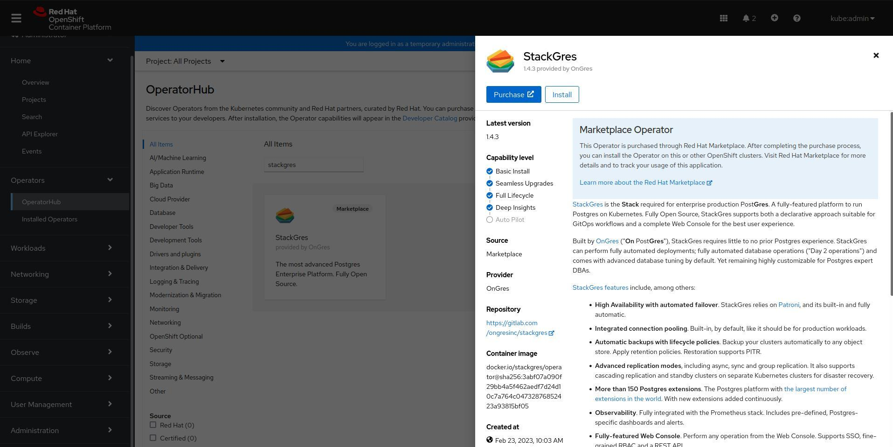
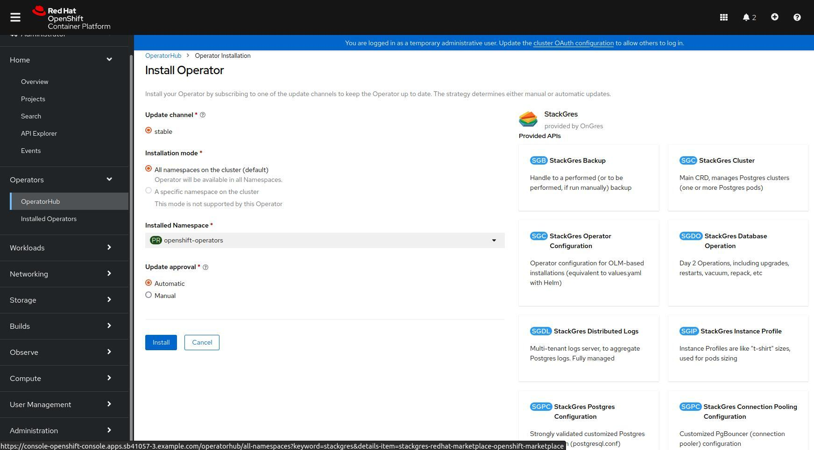

The StackGres operator can be installed via OperatorHub using the OLM ([Operator Lifecycle Manager](https://olm.operatorframework.io/)) that should already be installed in your Kubernetes cluster.
On this page, we are going through all the necessary steps to set up a production-grade StackGres environment.

## Installation via OperatorHub

StackGres (the operator and associated components) may be installed by creating the namespace, an operator group, and a subscription.

```
cat << EOF | kubectl create -f -
apiVersion: v1
kind: Namespace
metadata:
  name: stackgres
---
apiVersion: operators.coreos.com/v1
kind: OperatorGroup
metadata:
  name: stackgres
  namespace: stackgres
---
apiVersion: operators.coreos.com/v1alpha1
kind: Subscription
metadata:
  name: stackgres
  namespace: stackgres
spec:
  channel: stable 
  name: stackgres 
  source: operatorhubio-catalog
  sourceNamespace: olm
  installPlanApproval: Manual
EOF
```

> You can specify the version in the startingCSV field. For example, you may set it to `stackgres.v1.0.0` to install verion `1.0.0`.

The field `installPlanApproval` is set to `Manual` to prevent automatic upgrades of the operator in order to avoid having the operator upgraded before the StackGres custom resources are not upgraded to the latest version (for more info see the [upgrade section]({})).

To proceed with the installation you will have to patch the `InstallPlan` that has been created by the OLM operator:

```
kubectl get -n stackgres installplan -o name \
  | while read RESOURCE
    do
      kubectl patch -n stackgres "$RESOURCE" --type merge -p 'spec: { approved: true }'
      kubectl wait -n stackgres "$RESOURCE" --for condition=Installed
    done
```

The installation may take a few minutes.

Finally, the output will be similar to:

```plain
installplan.operators.coreos.com/install-66964 patched
installplan.operators.coreos.com/install-66964 condition met
```

Modify the configuration by patching the StackGres SGConfig

```
cat << EOF | kubectl patch -n stackgres sgconfig stackgres --type merge -p "$(cat)"
spec:
  grafana:
    autoEmbed: true
    secretName: prometheus-operator-grafana
    secretNamespace: monitoring
    secretPasswordKey: admin-password
    secretUserKey: admin-user
    webHost: prometheus-operator-grafana.monitoring
  adminui:
    service:
      type: LoadBalancer
EOF
```

> In some managed Kubernetes clusters and Kubernetes distribution a LoadBalancer may not be available, in such case replace `LoadBalancer` for `NodePort` and
>  you will be able to connect directly to the node port that will be assigned to the service. To retrieve such port use the following command:

```
kubectl get service -n stackgres stackgres-restapi --template '{{ (index .spec.ports 0).nodePort }}{{ printf "\n" }}'
```

### Installation on OpenShift 4.x

On OpenShift 4.x, the operator will be installed in the `openshift-operators` namespace so make sure to replace `stackgres` with `openshift-operators` in all the commands of this tutorial.

Since in OpenShift the namespace `openshift-operators` is already created you only need to create the Subscription:

```
cat << EOF | kubectl create -f -
apiVersion: operators.coreos.com/v1alpha1
kind: Subscription
metadata:
  name: stackgres
  namespace: openshift-operators 
spec:
  channel: stable 
  name: stackgres 
  source: redhat-marketplace
  sourceNamespace: openshift-marketplace
  installPlanApproval: Manual
EOF
```

> Alternatively you may install the StackGres Operator from the OpenShift Web Console by following these steps:
>
> 1. Search the StackGres Operator from the OperatorHub tab
     >     
> 2. After selecting it click on the "Install" button
     >     
> 3. Then use the default setting and click on "Install" button
     >     

To proceed with the installation you will have to patch the `InstallPlan` that has been created by the OLM operator:

```
kubectl get -n openshift-operators installplan -o name \
  | xargs -I @RESOURCE kubectl patch -n openshift-operators @RESOURCE --type merge -p 'spec: { approved: true }'
```

The installation may take a few minutes.

To wait for the installation to complete use the command:

```
kubectl get -n openshift-operators installplan -o name \
  | xargs -I @RESOURCE kubectl wait -n openshift-operators @RESOURCE --for condition=Installed
```

Finally, the output will be similar to:

```plain
installplan.operators.coreos.com/install-66964 condition met
```

Modify the configuration by patching the StackGres SGConfig

```
cat << EOF | kubectl patch -n openshift-operators sgconfig stackgres --type merge -p "$(cat)"
spec:
  grafana:
    autoEmbed: true
    secretName: prometheus-operator-grafana
    secretNamespace: monitoring
    secretPasswordKey: admin-password
    secretUserKey: admin-user
    webHost: prometheus-operator-grafana.monitoring
  adminui:
    service:
      type: LoadBalancer
EOF
```

> In some managed Kubernetes clusters and Kubernetes distribution a LoadBalancer may not be available, in such case replace `LoadBalancer` for `NodePort` and
>  you will be able to connect directly to the node port that will be assigned to the service. To retrieve such port use the following command:

```
kubectl get service -n openshift-operators stackgres-restapi --template '{{ (index .spec.ports 0).nodePort }}{{ printf "\n" }}'
```

