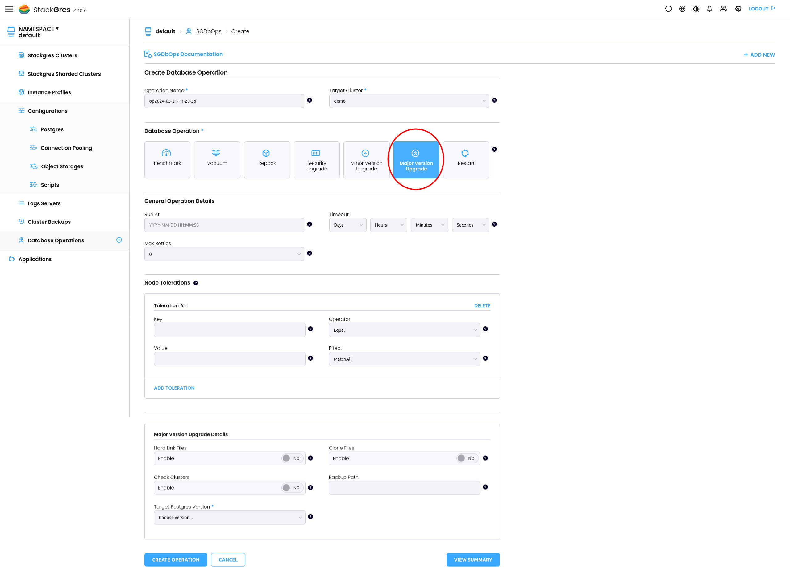

StackGres provides an easy way to perform a Postgres Major version upgrade, e.g, from `15.6` to `16.2`. It provides two different ways to perform a major version upgrade, using the Web Console or by using the Kubernetes API through the `kubectl` CLI. 

The process is meant to be straightforward, however, you need to perform some previous checks to guarantee that the process will complete successfully. 

## Preliminary Checks recommended

1. Available disk space depending if you will use hard links or not.
2. If you are using extensions, check if they are compiled for the Postgres version you're planning to migrate to. ([Extensions](https://stackgres.io/extensions/))
3. Make sure you have an up to date backup.
4. Make sure you have [SGPostgresConfig]({}) for the postgres version you're planning to migrate to.
5. Performed the upgrade in a test environment.

## Steps to perform a Major version upgrade using de Web Console.

1. Go to `Database Operations` 


2. Click over the Plus (+) button 

3. Then the `Create Database Operation` page will be open.

4. Choose your target cluster

5. Select the `Major version upgrade` Operation



6. You can set the process to be executed in a specific time, if not set the process will be executed immediately.

7. If is required you can add the Node Tolerations.

8. Check the options under the `Major version upgrade details`


  - **Hard link files:** If true use hard links instead of copying files to the new cluster. This option is mutually exclusive with clone. Defaults to: false.


    >**Important:** Be aware that if you use the default, all data files will be copied to a new directory, so you need to make sure you have enough disk space to perform the operation. Otherwise, you'll run out of space.  

    The main perk of copying the files is that you can roll back to the old cluster in case of a failure. Meanwhile when using hard links, once the data directory is changed there's no roll back option. 

  - **Clone files:** If true use efficient file cloning (also known as “reflinks” on some systems) instead of copying files to the new cluster. This can result in near-instantaneous copying of the data files, giving the speed advantages of link while leaving the old cluster untouched. This option is mutually exclusive with link. Defaults to: false.

    File cloning is only supported on some operating systems and file systems. If it is selected but not supported, the pg_upgrade run will error. At present, it is supported on Linux (kernel 4.5 or later) with Btrfs and XFS (on file systems created with reflink support), and on macOS with APFS.

  - **Check Cluster:** If true does some checks to see if the cluster can perform a major version upgrade without changing any data. Defaults to: false.

  - **Backup path:** The path were the backup is stored. If not set this field is filled up by the operator.

    When provided will indicate were the backups and WAL files will be stored.

    The path should be different from the current `.spec.configurations.backups[].path` value for the target SGCluster in order to avoid mixing WAL files of two distinct major versions of postgres.

  - **Target Postgres version:** The target postgres version that must have the same major version of the target SGCluster.

  - **Target Postgres Configuration:** The postgres config ([SGPostgresConfig]({})) that must have the same major version of the target postgres version.


9. Once you select the apropiate options click on `Create Operation`


## Major version upgrade using the kubectl CLI

In order to execute the process by using the `kubectl` CLI, you need to create the SGDbOps manifest. In the next example a major version upgrade from Postgres version `15.6` to `16.2` will be performed:

To execute the process create and apply the manifest with the next command:  

```yaml
cat << EOF | kubectl apply -f -
apiVersion: stackgres.io/v1
kind: SGDbOps
metadata:
  name: my-major-version-upgrade
  namespace: default
spec:
  majorVersionUpgrade:
    check: false
    clone: false
    link: true
    postgresVersion: "16.2"
    sgPostgresConfig: postgres-16-config
  maxRetries: 0
  op: majorVersionUpgrade
  sgCluster: demo
EOF
```

>Note: You can check all the available options here [SGDbOps Major version upgrade]({})

You can check the process log on the process pod called `major-version-upgrade` 

```bash
kubectl logs demo-0 -c major-version-upgrade
```

At the end of the logs you should see something like:

```bash
...
+ read FILE
+ touch /var/lib/postgresql/upgrade/.upgrade-from-15.6-to-16.2.done
+ echo 'Major version upgrade performed'
Major version upgrade performed
```